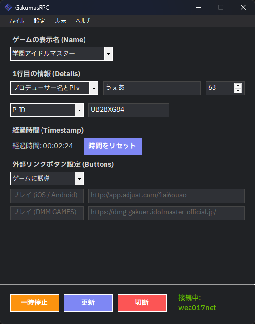
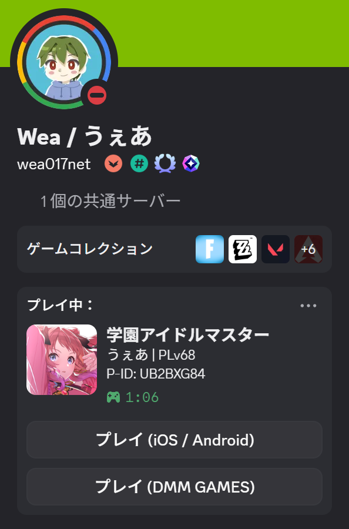
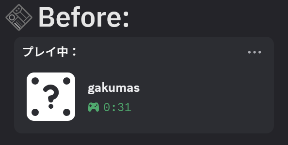
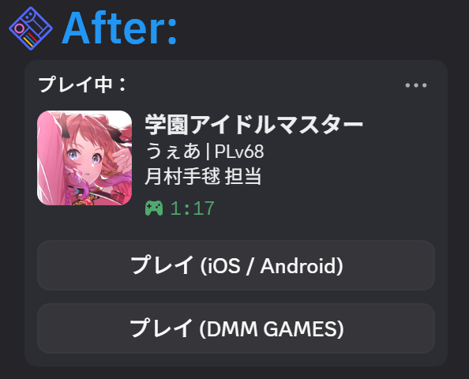

<p align="center">
  
</p>

<h1 align="center">学マステータス / GkmStatus</h1>

<p align="center">
『学園アイドルマスター』のプレイヤー情報を Discord のアクティビティに表示できる<br>非公式ファンメイドアプリケーション
</p>

<p align="center">
  <a href="README.md">日本語</a> | <a href="README_en.md">English</a>
</p>

<p align="center">
  <a href="https://opensource.org/licenses/MIT"></a>
  <a href="https://github.com/Wea017net/GkmStatus/releases/latest"></a>
  <a href="https://github.com/maximmax42/Discord-CustomRP/releases"></a>
  
</p>

<p align="center">
  
  
</p>

<p align="center">
  &nbsp;&nbsp;&nbsp;
  &nbsp;&nbsp;&nbsp;&nbsp;&nbsp;&nbsp;&nbsp;&nbsp;&nbsp;&nbsp;
</p>

## 機能

*   自身のプロデューサー名、プロデューサーレベル、P-ID を表示
*   プロデュース中のアイドル（手動指定）や担当アイドルの名前を表示
*   新規プレイヤーを誘導できるボタンの表示
*   ゲームの起動状況を検知して自動で Discord に接続・切断（DMM GAMES版が対象）

## このプロジェクトの目的

DMM GAMES版学園アイドルマスターは Discord の認証済みゲームではないため、アクティビティにはゲーム名しか表示することができません。
また、ゲーム側にもプレイ状況の詳細を Discord に送信する機能は備わっていません。

そこで、このアプリケーションを使用することでゲーム名だけでなくゲームアイコン、PLv や P-ID 、ゲームのダウンロードに誘導するボタンなどをアクティビティに表示させることができます。

<p>
  
  &nbsp;&nbsp;
  
</p>

アクティビティにプレイヤーの情報を表示させることで、プロデューサー同士のコミュニケーションの活性化に繋がったり、ゲームのダウンロード誘導ボタンを表示させることで、新規プレイヤーの増加に繋がったりすることを期待します。

## 動作環境

*   Windows 10 64-bit / Windows 11 64-bit
*   [.NET 10.0 Runtime](https://dotnet.microsoft.com/ja-jp/download/dotnet/10.0)

## 対応言語

* 日本語 (ja)
* English (en)

## 使い方

1.  [Releases](https://github.com/Wea017net/GkmStatus/releases) から最新のファイルをダウンロードします。
2.  zipファイルを展開します。
3.  フォルダ内の `GkmStatus.exe` を実行します。
4.  ゲームの表示名や自分のプレイヤー情報など、Discord に表示させたい内容を入力します。
5.  接続ボタンを押すと、Discord のアクティビティに入力した内容が表示されます。

> [!NOTE]
> <p align="left">
>   
> </p>
> 
> 起動時に上記のウィンドウが表示された場合、ご利用のPCに `.NET Runtime 10.0` がインストールされていないため、 `Download it now` をクリックし、ダウンロードされた `windowsdesktop-runtime-10.0.x-win-x64.exe` を開いてインストールしてください。

> [!TIP]
> 設定 → `gakumas.exeを監視して自動で接続/切断` がオンになっていれば、接続ボタンを押さなくても DMM GAMES版の学マスを起動状況を検知して自動で接続・切断ができます。
（この設定は初回起動時にオンになっています。）
> 
> `システム起動時に実行` , `最小化した状態(システムトレイ内)で起動` , `gakumas.exeを監視して自動で接続/切断` の3つをオンにすることで、手動でアプリを起動・操作することなくステータスの表示・非表示ができるのでおすすめです。

## 注意事項

Discord の仕様により、外部リンクボタンの表示は自分で確認することができません。カスタムのボタン設定を使用して確認をしたい場合、他のアカウントからプロフィールを表示する必要があります。

## 開発者向け

### ビルド方法

1.  Visual Studio 2026 または .NET SDK 10.0 をインストールします。
2.  リポジトリをクローンします。
    ```bash
    git clone https://github.com/Wea017net/GkmStatus.git
    ```
3.  プロジェクトを開き、ビルドを実行します。

## フィードバック / 不具合報告
不具合の報告や機能のリクエストは [Issues](https://github.com/Wea017net/GkmStatus/issues) または X ( [@Wea017net](https://x.com/Wea017net) ) のダイレクトメッセージにてお気軽にお寄せください。

## ライセンス

このプロジェクトは [MIT License](LICENSE) のもとで公開されています。

## 免責事項

> [!WARNING]
> **本ソフトウェアは自己責任でご利用ください。**  
> 本ソフトウェアの使用に関連して生じたいかなる損害（データの損失、PCの不具合、Discordアカウントへの影響、その他のトラブルなど）についても、作者は一切の責任を負いません。

### このプロジェクトについて

本プロジェクトは『学園アイドルマスター』に関連した**非公式のファンメイドアプリケーション**で、非商用のファン活動として公開されています。

本プロジェクトは株式会社バンダイナムコエンターテインメント、株式会社QualiArts、および関連各社とは **一切関係がなく、また公式に承認・公認されたものではありません。**

『学園アイドルマスター』に関するすべての商標・著作権および関連する権利は株式会社バンダイナムコエンターテインメントおよび各権利者に帰属します。

### 権利者からの要請について

権利者からの要請があった場合、または作者が不適切と判断した場合には、予告なく本プロジェクトの公開・配布を停止することがあります。

### 外部サービスについて

本アプリケーションは Discord の Rich Presence 機能を利用しています。  
Discord 側の仕様変更などにより、予告なく機能が利用できなくなる場合があります。

## 使用ライブラリ・アセット

- **[DiscordRichPresence](https://github.com/Lachee/discord-rpc-csharp)** (Licensed under the [MIT License](https://github.com/Lachee/discord-rpc-csharp/blob/master/LICENSE))
  - Copyright (c) 2021 Lachee
- **[IBM Plex Sans JP](https://fonts.google.com/specimen/IBM+Plex+Sans+JP)** (Licensed under the [SIL Open Font License](https://github.com/Wea017net/GkmStatus/blob/main/GkmStatus/Resources/fonts/IBM_Plex_Sans_JP/OFL.txt), Version 1.1)
  - Copyright © 2017 IBM Corp.
 
## 先駆者様

先行プロジェクトに敬意を表します。
- [gakumasRPC](https://github.com/vermilion10/gakumasRPC) - by @vermilion10
