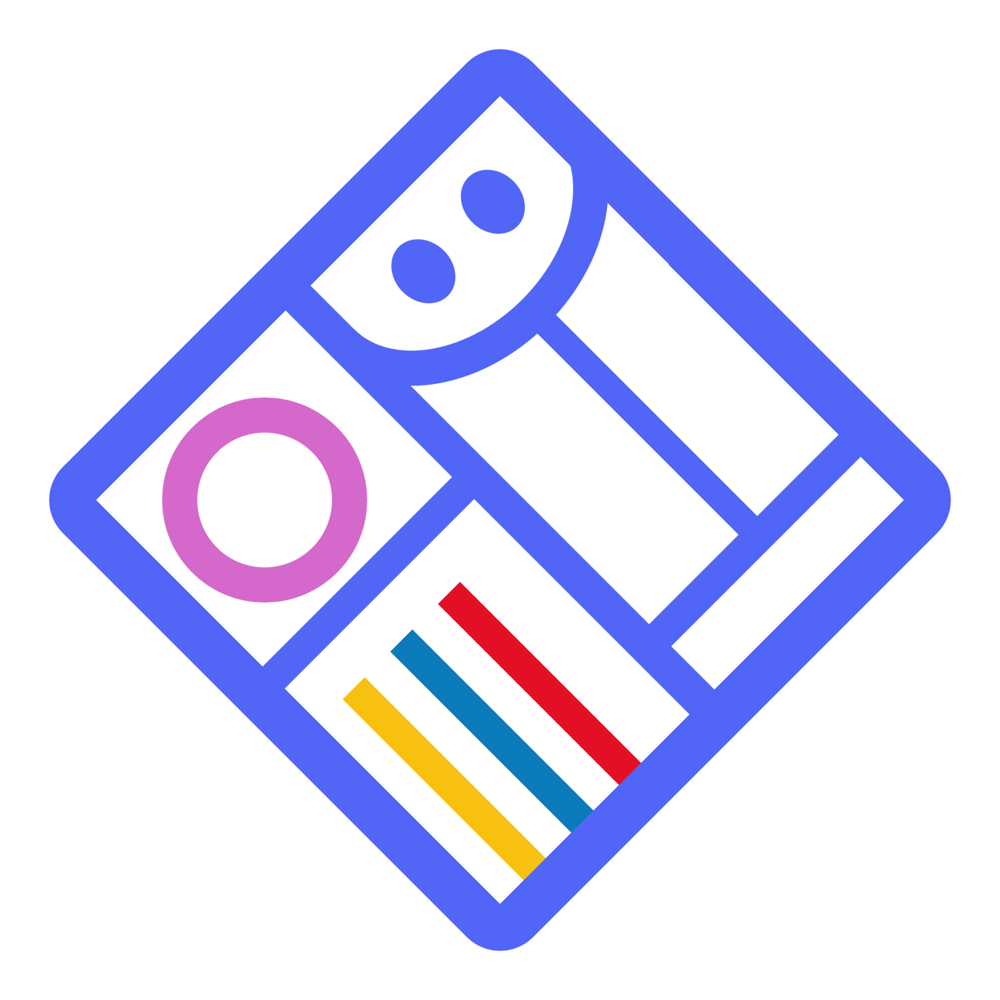
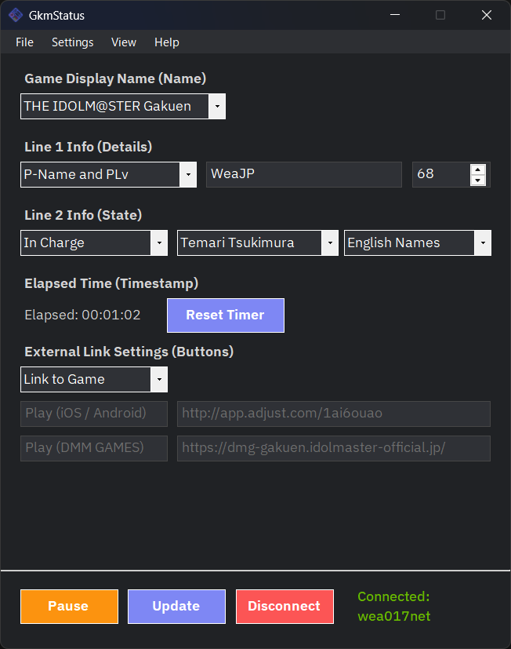
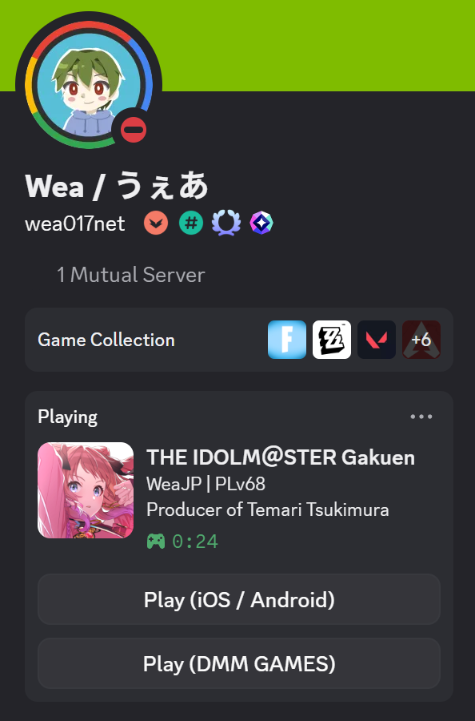
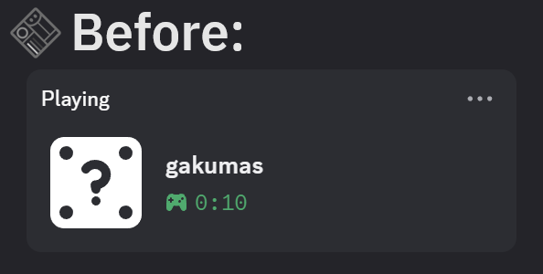
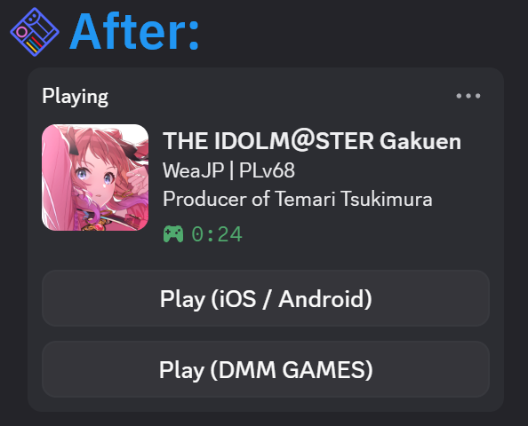
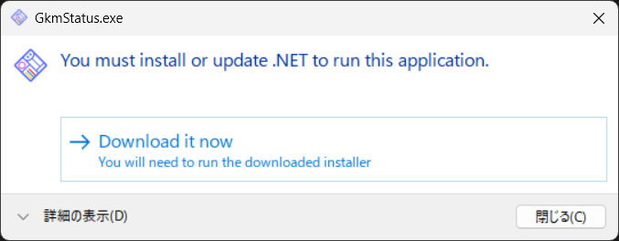

<p align="center">
  
</p>

<h1 align="center">GkmStatus (学マステータス)</h1>

<p align="center">
An unofficial fan-made application that displays your THE iDOLM@STER Gakuen player information on your Discord activity.
</p>

<p align="center">
  <a href="README.md">日本語</a> | <a href="README_en.md">English</a>
</p>

<p align="center">
  <a href="https://opensource.org/licenses/MIT"></a>
  <a href="https://github.com/Wea017net/GkmStatus/releases/latest"></a>
  <a href="https://github.com/Wea017net/GkmStatus/releases"></a>
  
</p>

<p align="center">
  
  
</p>

<p align="center">
  &nbsp;&nbsp;&nbsp;
  &nbsp;&nbsp;&nbsp;&nbsp;&nbsp;&nbsp;&nbsp;&nbsp;&nbsp;&nbsp;
</p>

## Features

* Displays your Producer Name, Producer Level (PLv), and P-ID.
* Displays the idol you are currently producing (manual setting) or your favorite idol.
* Displays a custom button to redirect new players to the game.
* Automatically connects/disconnects to Discord by detecting the game's launch status (for the DMM GAMES version).

## Purpose of this Project

Since the DMM GAMES version of *Gakuen Idolmaster* is not a verified game on Discord, only the game name can normally be displayed in your activity. Additionally, the game itself does not have a native feature to send detailed play status to Discord.

By using this application, you can display not only the game name but also the game icon, your PLv, P-ID, and a game download button on your Discord activity.

<p>
  
  &nbsp;&nbsp;
  
</p>

We hope that displaying player information in the activity will encourage communication among producers, and that the download button will help attract new players to the game.

## System Requirements

* Windows 10 64-bit / Windows 11 64-bit
* [.NET 10.0 Runtime](https://dotnet.microsoft.com/en-us/download/dotnet/10.0)

> [!NOTE]
> Running on Windows on ARM, macOS, or Linux is not supported.

## Supported Languages

* Japanese (ja)
* English (en)

## How to Use

1.  Download the latest release from the [Releases](https://github.com/Wea017net/GkmStatus/releases) page.
2.  Extract the downloaded zip file.
3.  Run `GkmStatus.exe` inside the extracted folder.
4.  Enter the information you want to display on Discord, such as the game display name and your player information.
5.  Click the Connect button to display the entered details on your Discord activity.

> [!NOTE]
> If the "Windows protected your PC" window appears, you can launch the app by clicking `More info` and then clicking the `Run anyway` button that appears at the bottom of the window.
> 
> <p align="left">
>   
> </p>
> 
> If the window above appears on startup, it means `.NET Runtime 10.0` is not installed on your PC. Please click `Download it now`, then open and install the downloaded `windowsdesktop-runtime-10.0.x-win-x64.exe`.

> [!TIP]
> If "Settings -> `Monitor gakumas.exe and auto connect/disconnect`" is enabled, the app will automatically connect and disconnect from Discord by detecting the DMM GAMES version's launch status without needing to press the connect button. (This setting is enabled by default on the first launch).
> 
> I recommend enabling all three settings: `Run at system startup`, `Start minimized in tray`, and `Monitor gakumas.exe and auto connect/disconnect`. This allows you to show and hide your status without having to manually open or operate the app.

## Important Notes

Due to Discord's specifications, you cannot click or verify your own external link buttons on your own profile. If you want to check how your custom buttons look and work, you will need to view your profile from a different Discord account.

## For Developers

### Build Instructions

1.  Install Visual Studio 2026 or .NET SDK 10.0.
2.  Clone the repository.
    ```bash
    git clone [https://github.com/Wea017net/GkmStatus.git](https://github.com/Wea017net/GkmStatus.git)
    ```
3.  Open the project and build it.

## Feedback / Bug Reports

Feel free to report bugs or request features via [Issues](https://github.com/Wea017net/GkmStatus/issues) or via Direct Message on X ( [@Wea017net](https://x.com/Wea017net) ).

## License

This project is licensed under the [MIT License](LICENSE).

## Disclaimer

> [!WARNING]
> **Please use this software at your own risk.** > The author assumes no responsibility for any damages (including but not limited to loss of data, PC malfunction, impact on Discord accounts, or other troubles) resulting from the use of this software.

### About this Project

This project is an **unofficial fan-made application** related to *Gakuen Idolmaster* and is published strictly as a non-commercial fan activity.

This project is **in no way affiliated with, authorized, or endorsed by** Bandai Namco Entertainment Inc., QualiArts, Inc., or any related entities.

All trademarks, copyrights, and related rights concerning *Gakuen Idolmaster* belong to Bandai Namco Entertainment Inc. and their respective rights holders.

### Regarding Requests from Rights Holders

The publication and distribution of this project may be suspended without notice upon request from the rights holders or if the author deems it inappropriate.

### Regarding External Services

This application utilizes Discord's Rich Presence feature. Functions may become unavailable without notice due to specification changes or updates by Discord.

## Libraries & Assets

- **[DiscordRichPresence](https://github.com/Lachee/discord-rpc-csharp)** (Licensed under the [MIT License](https://github.com/Lachee/discord-rpc-csharp/blob/master/LICENSE))
  - Copyright (c) 2021 Lachee
- **[IBM Plex Sans JP](https://fonts.google.com/specimen/IBM+Plex+Sans+JP)** (Licensed under the [SIL Open Font License](https://github.com/Wea017net/GkmStatus/blob/main/GkmStatus/Resources/fonts/IBM_Plex_Sans_JP/OFL.txt), Version 1.1)
  - Copyright © 2017 IBM Corp.
 
## Special Thanks

Respect and gratitude to the preceding project and the amazing tool that inspired the UI design:

- [gakumasRPC](https://github.com/vermilion10/gakumasRPC) - by @vermilion10
- [CustomRP](https://github.com/maximmax42/Discord-CustomRP) - by @maximmax42